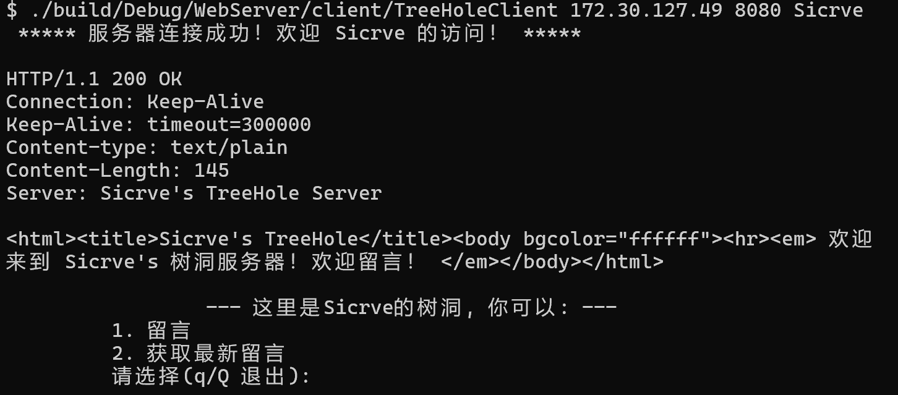
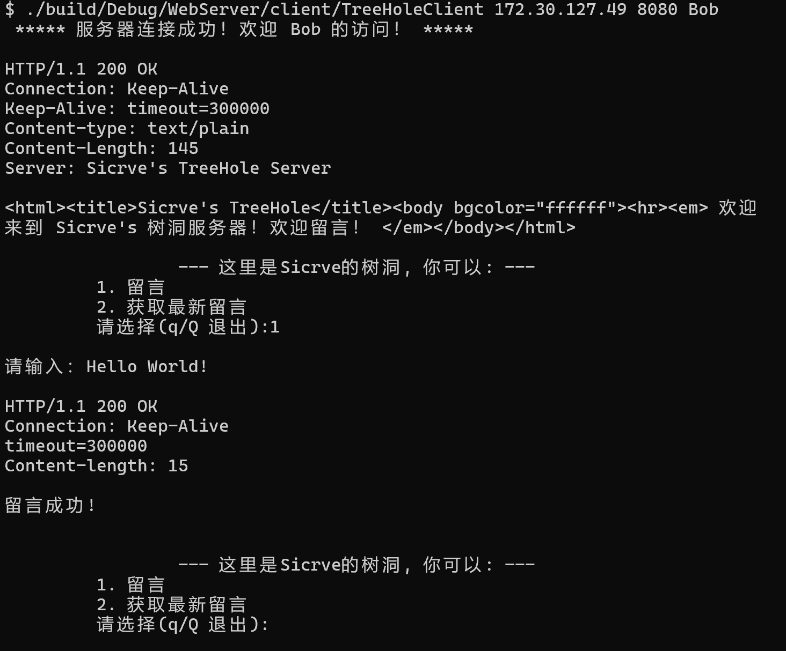
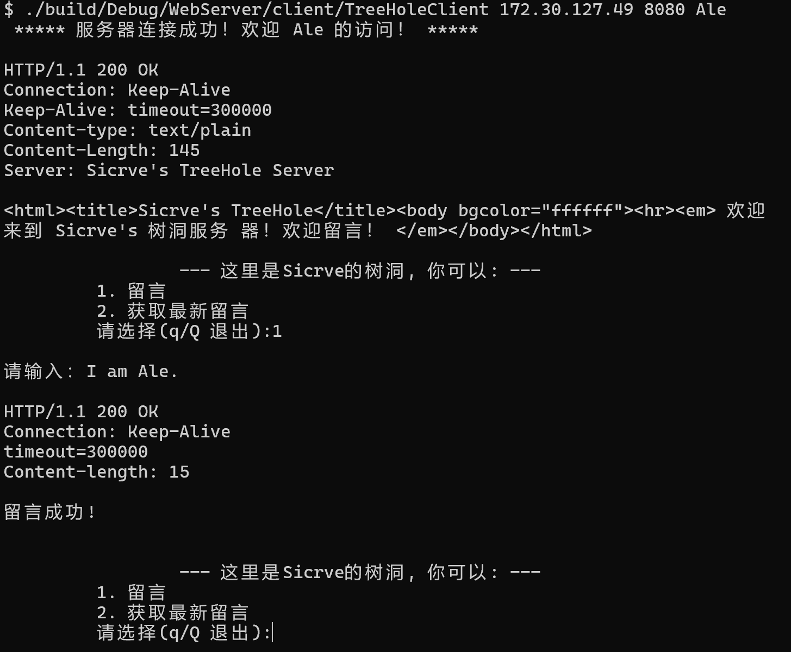
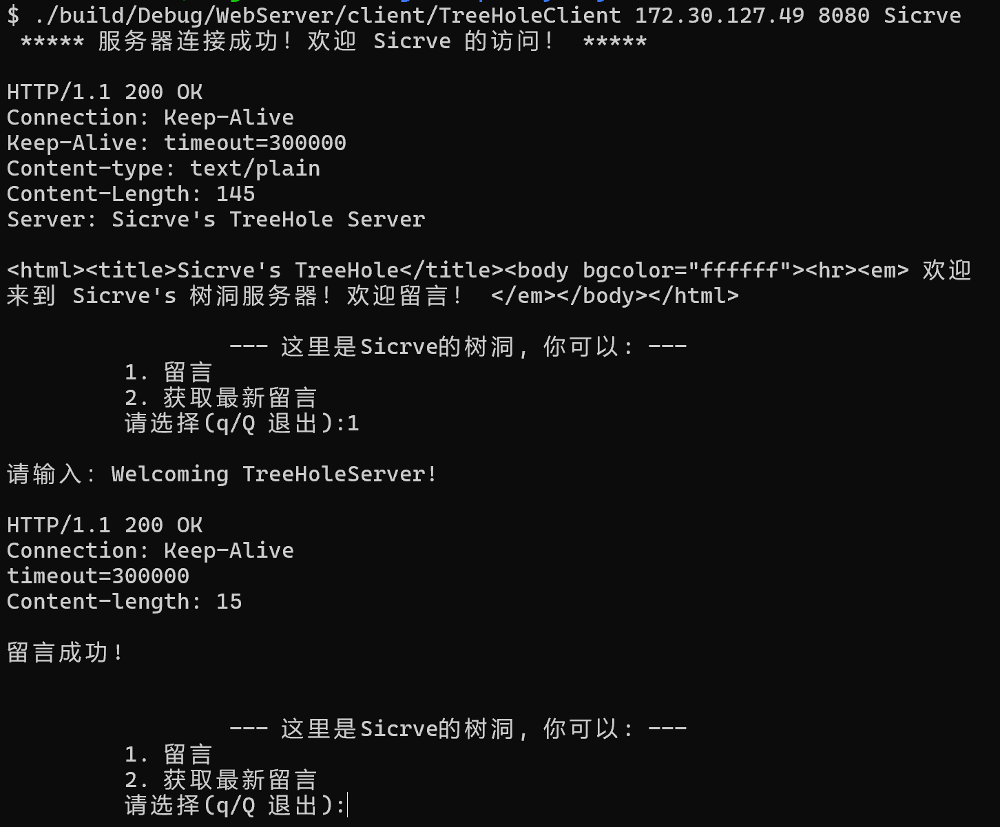
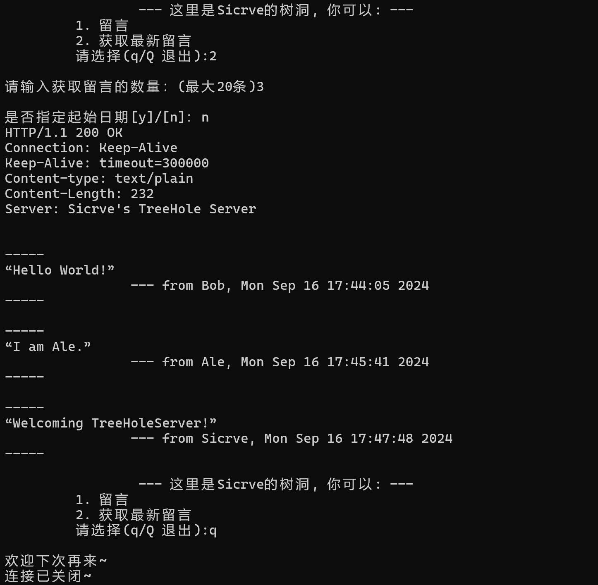
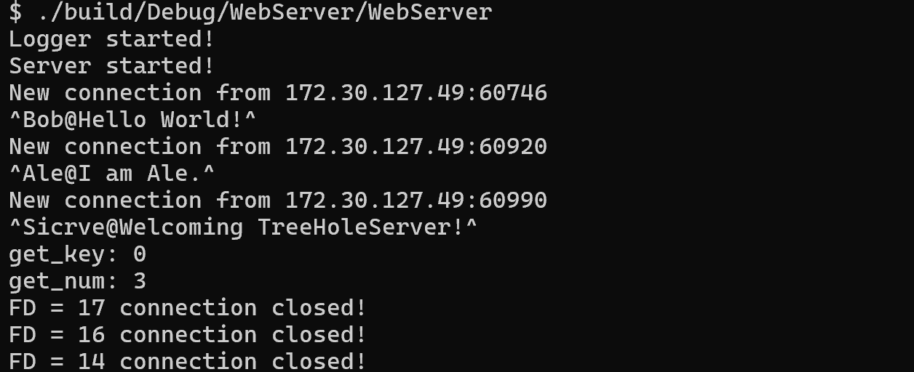
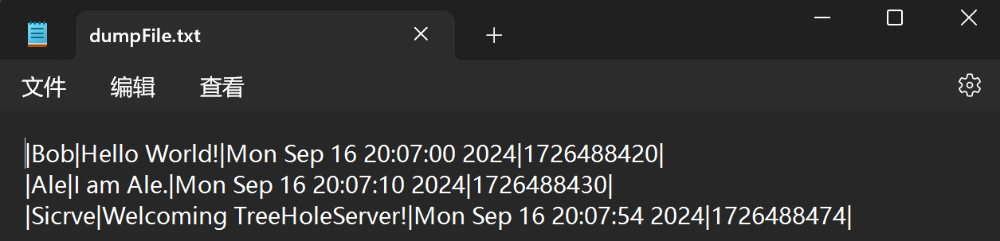
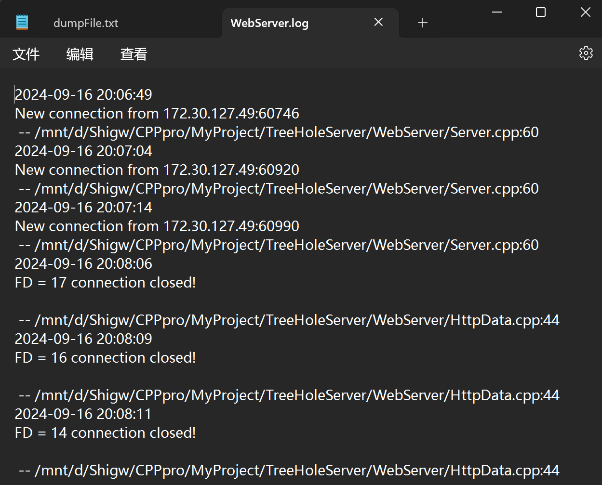
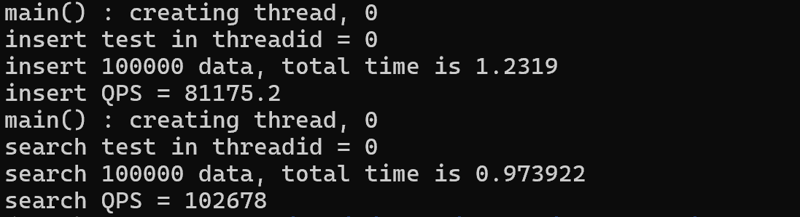

# TreeHoleServer

​		该项目是本人在学习Linux网络编程时独立开发的轻量级树洞服务器，项目主体是一个IO多路复用的Web服务器，在应用层上结合HTTP协议，使用POST和GET请求实现多用户留言和获取留言功能。

## 快速开始

```shell
# 编译
sh ./build.sh

# 服务端启动 (参数为：端口号、线程池内线程数量、跳表最大层数)
#./build/Debug/WebServer/WebServer <Port> <threadNum> <skiplistLevel>
./build/Debug/WebServer/WebServer 8080 4 10

# 客户端启动 (参数为：服务端IP、服务端端口、登录用户名)
#./build/Debug/WebServer/client/TreeHoleClient <IP> <Port> <username>
./build/Debug/WebServer/client/TreeHoleClient <IP> 8080 Sicrve
```

## 1. 项目展示

### 1.1 客户端登录界面



### 1.2 留言







### 1.3 获取留言



### 1.4 服务器端输出情况

#### 1.4.1 控制台输出：



#### 1.4.2 存储引擎输出：



#### 1.4.3 日志输出：




## 2. 项目主要内容

​		该项目主要由服务器网络框架、应用层处理、存储引擎、日志系统四部分组成。

### 2.1 服务器网络框架

​		服务器网络框架采用主从Reactor+线程池的模型构建，实现One Loop Per Thread运行模式，采用边缘触发和非阻塞socket，支持多用户请求。支持长连接、短连接，支持客户端主动关闭、服务器端超时关闭、错误关闭。

### 2.2 应用层

​		应用层上通过解析POST、GET请求并使用自定义数据流边界的方式实现留言和获取留言功能。

```c++
数据流边界:	^ @ ^
	POST: 	^key@number^
	GET:	^username@whisper^
```

### 2.3 存储引擎

​		存储引擎方面，采用跳表实现轻量级KV存储引擎，用于管理顺序留言数据，支持本地存储和读取功能。

### 2.4 日志系统

​		日志系统方面，借鉴双缓存技术分割日志场景中的生产者和消费者，结合写回线程实现异步日志系统。

## 3. 性能测试

​		测试环境：Ubuntu 22.04，AMD 7840HS，8G内存

### 3.1 网络压力测试：

​		采用边缘触发模式，并发连接数100，所有访问均成功，QPS为3万+。


### 3.2 存储引擎测试：

​		使用单独的线程，对层级为10的跳表进行随机插入、查询测试，插入QPS为8万+，读取QPS为10万+。



## 代码统计

​	共计 4221 行。

## Todo list

## todo list

- 服务器性能方面：增加内存池，实现内存复用。

- 应用层功能方面：这个项目目前只实现了公共树洞，在之后打算新增多频道树洞功能，并对每个频道计算讨论热度等，类似于匿名微博。此外，考虑使用QT进行开发桌面应用。

## 参考内容

https://github.com/linyacool/WebServer/tree/master

https://github.com/qinguoyi/TinyWebServer

https://www.cnblogs.com/dogwealth/p/17938194

《Linux高性能服务器编程》-游双

《Linux多线程服务器编程-使用 muduo C++网络库》-陈硕


