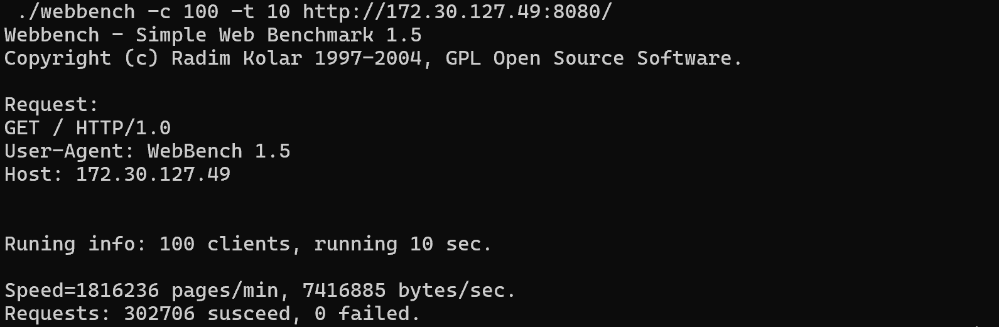

## WebBench 1.5

**测试环境**：WSL2 - Ubuntu 22.04.3 LTS
processors：8
MemTotal:        8136736 kB
SwapTotal:       4194304 kB
VmallocTotal:   34359738367 kB

**测试结果**：

- Reactor + ET，30270 QPS

- 并发连接总数：100
- 访问服务器时间：10s
- 所有访问均成功