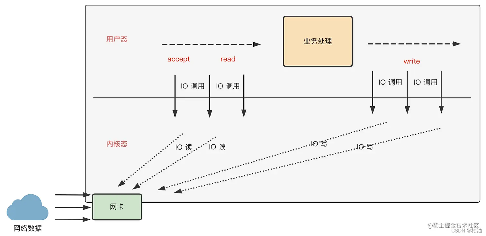
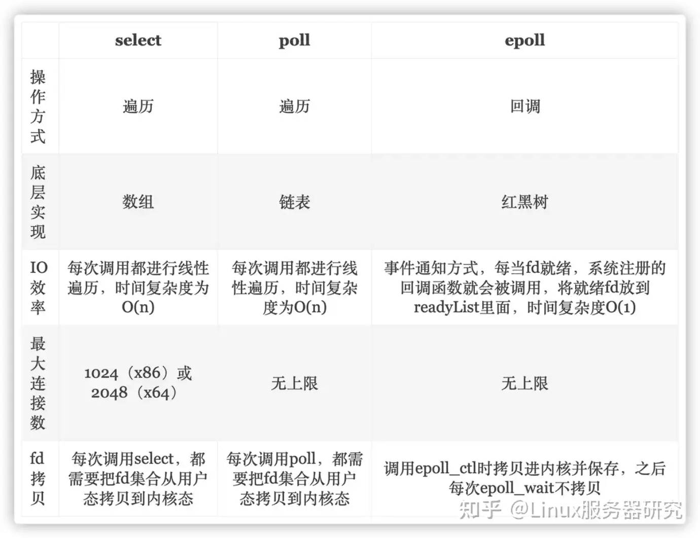
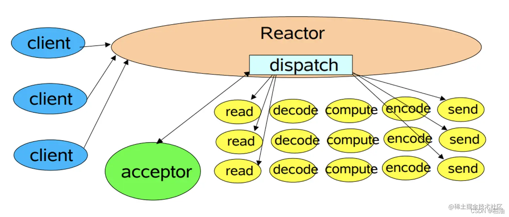
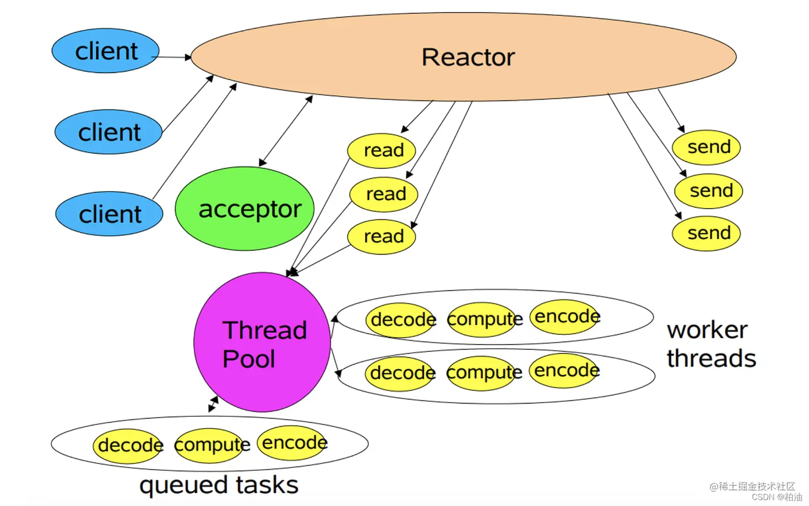
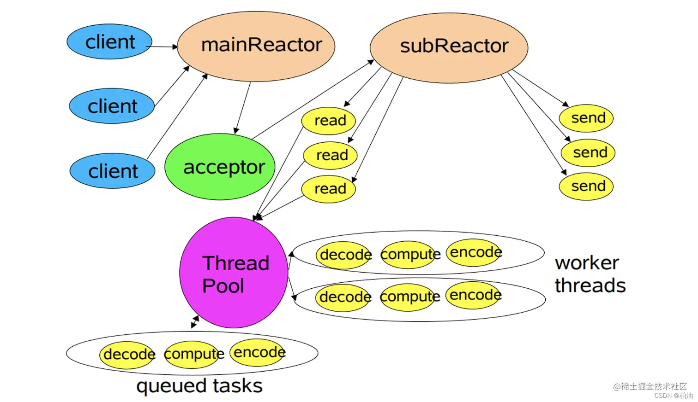
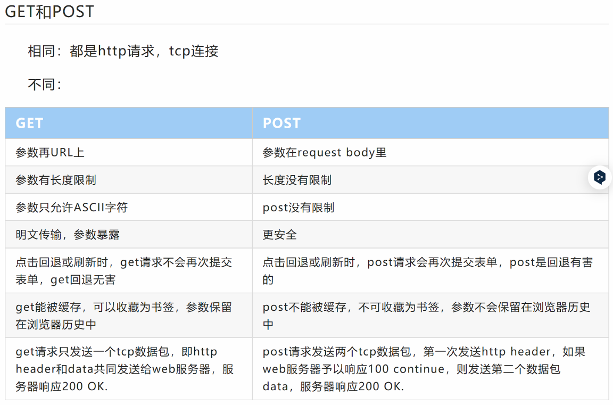

## 项目：树洞服务器

### 01 简单介绍项目

​		这个项目是我在学习计算机网络和Linux socket编程过程中独立开发的轻量级树洞服务器。项目主体是一个IO多路复用的web服务器，在应用层上结合http协议，使用post和get请求实现留言和获取留言，最后做成了树洞服务器。

​		项目主要包含服务器网络框架、应用层处理、存储引擎、日志系统四部分组成。服务器网络框架采用reactor并发框架，是以主从reactor+线程池的模式构建的，实现了One Loop Per Thread的运行模式。在IO处理上，采用epoll的IO复用技术，并实现边缘触发和非阻塞IO模式。应用层上通过自定义数据流边界的方式通过结合post请求和get请求实现了留言和获取留言的功能。在存储引擎方面，采用跳表实现了轻量级的KV存储引擎，用于快速检索指定时间留言，同时支持文件存储和读取功能。在日志系统方面，通过双缓存等技术实现了异步日志系统。

​		在项目测试方面，除了基本的单元测试外，我还对服务器框架和存储引擎进行了测试。对于⽹络框架的测试，使⽤webbench创建100个进程对服务器进⾏10s并发请求，QPS为3万 。对于存储引擎的压⼒测试，在本地测试下，存储引擎读操作的QPS可以达到36万，写操作的QPS可以达到30万。 

​		最后，项目扩展方面。在效率方面，可以扩增内存池，实现内存复用。在功能方面：这个项目目前只实现了公共树洞，在之后打算新增多频道树洞功能，并对每个频道计算讨论热度等，就像做一个匿名的微博。此外，我也在考虑使用QT等桌面工具编写客户端。

---

### 02 项目细节

#### 2.1 服务器网络框架

​		服务器网络框架采用reactor并发框架，是以主从reactor+线程池的模式构建的，实现了One Loop Per Thread的运行模式。在IO处理上，采用epoll的IO复用技术，并实现边缘触发和非阻塞IO模式。

​		网络模型其实就是应对网络IO的线程模型，目前主要有reactor框架和proacter框架。

**2.1.1 IO模型：**   
		IO是指计算机内存与外部设备之间的拷贝数据过程，这些设备在linux系统中主要是有一些文件描述符进行控制和管理的。整个过程主要有两部分：从IO设备到内核态内存（数据就绪），内核态内存到用户态内存（数据拷贝）两个部分。针对这两个部分，主要有4种主要的IO模型：① 同步阻塞IO；② 同步非阻塞IO；③ IO多路复用；④ 异步IO。

​		**阻塞与非阻塞**：是指IO操作时直接返回还是阻塞等待（主要是说第一阶段）。

​		**同步与异步**：是指在数据从内核态拷贝到用户态时，如果由内核主动发起则说明是异步（不阻塞），如果是由用户态阻塞等待触发，则是同步（主要描述第二阶段）。

​		① 同步阻塞IO（全程阻塞）；② 同步非阻塞IO（直接返回失败，数据就绪时返回成功）；③ IO多路复用（委托操作系统监控事件，如果就绪才唤醒）；④  异步IO（提交io后返回回调函数，等数据准备就绪以及拷贝结束时才通知进程处理）。

​		同步非阻塞IO和IO多路复用原理差不多，都需要轮询访问，只是同步非阻塞IO则需要每个线程自己轮询，而IO多路复用是由系统线程统一管理，极大节省资源。

​		

**2.1.2 IO多路复用：**   
		IO多路复用是目前主流的IO线程模型，也是目前并发框架中采用的主要方式。通过委托系统监控多个连接，将其中的就绪事件进行返回统一处理即可（通常会结合线程池等方式进行）。

​		而使用多进程或多线程实现的并发服务器中，每个线程都需要去维护某个连接，因此当出现长连接时就会造成系统极大的繁忙。

​		IO多路复用主要有3种，select、poll、epoll

​		前两者select和poll每次调用都需要将需要监控的fd集合复制到内核区，然后采用遍历的方式进行监控，同时在返回后也需要遍历传入的每个事件集合，然后才能知道哪些连接发生了事件，因此开销比较大。select采用数组的方式存储，poll采用链表的方式存储。

​		而epoll则是对这种方式进行了改进，通过将分成三个接口函数epoll_create、epoll_ctl、epoll_wait进行管理，epoll_create会在内核区的高速Cache中创建红黑树索引，epoll_ctl负责对事件进行增删改，注册的事件会同时注册回调函数，当事件发生时会自动写入就绪链表中，epoll_wait负责获取就绪链表，如果有数据则直接返回，没有数据会sleep等待（因此返回的是就绪链表）。epoll采用红黑树和链表结合的数据结构。

​		IO多路复用是通过事件驱动的方式完成的，即某个事件就绪时，才会通知对应的线程。

**2.1.3 介绍一下reactor：**   
		reactor模型是基于IO多路复用构建起来的非阻塞同步网络模式，由事件驱动（监听），IO事件读写处理以及事务处理等环节组成。主要由reactor线程和handlers处理器两个部分构成。

​		reactor线程负责连接建立、事件监听、IO事件读写，任务分配等。而handlers则主要是负责业务逻辑的执行。

​		reactor模型主要有三类：① 单线程模型；② 多线程模型；③ 主从多线程模型。

​		**① 单线程模型：**   
​		所有的连接建立、事件监听、IO处理、业务处理都在一个线程上完成。   

​		首先单线程并不能发挥多核CPU的性能，其次单线程会造成严重的瓶颈问题。

​		**② 多线程模型：**    
​		对于单线程的问题，这里就通过多线程（线程池）的方式，将业务处理逻辑分配各不同的线程进行完成。

​		简单多线程模型将耗时的业务处理分配给不同的线程来完成，极大的提高了性能，然而将请求数量过多时，单个接受的线程可能无法处理，同时IO阻塞阶段也会造成连接的阻塞，导致新连接请求无法及时处理。

​		**③ 主从多线程模型：**   
​		针对简单多线程的问题，这里将连接请求处理和事件监听、io读写处理进行了分离，主reactor只负责新连接的处理和任务的分配，而子reactor则负责自己监控的各个连接以及对应的事务处理。

**2.1.4 了解proactor吗，它与reactor的区别？**
		proactor是异步网络模式，感知的是已完成的读写事件。在发起异步读写请求时，需要传入读写地址，然后委托操作系统将数据进行接受并拷贝到用户内存区。当拷贝完成后才会通知相应的进程。

​		而reactor是非阻塞的同步网络模型，所谓的同步是指在数据准备就绪时，需不需要用户线程阻塞等待，也就是这个拷贝的过程是同步的。

​		不用proactor的原因：linux下的异步IO是不完善的，aio 系列函数是由 POSIX 定义的异步操作接⼝，不是真正的操作系统级别⽀持的，⽽是在⽤户空间模拟出来的异步，并且仅仅⽀持基于本地⽂件的 aio 异步操作，⽹络编程中的 socket 是不⽀持的。目前看到的资源中大部分是reactor框架，只有少数是使用单独读写线程模拟的proactor框架，这一部分还有待学习。

**2.1.5 ET和LT**   
		EPOLLET（电平触发）和EPOLLLT（水平触发）是epoll支持的两种监控模式，会根据不同的情况对任务有不同的响应。

​		LT称为水平触发，只要数据没有被处理（有数据，可读、可写的状态），内核会一直返回这个事件，导致产生了大量的epoll系统调用，因此在大并发、大流量的情况下效率比较低下（select和poll都是这种模式，epoll默认也是这种模式）。然而这种一直通知的方式不会担心事件丢失，因此代码的逻辑就会比较简单。LT支持非阻塞和阻塞的socket。

​		ET称为电平触发或者边缘触发，是高速工作模式，只会在描述符状态发生改变时（如从未就绪转变到就绪状态）操作系统才会通知，但之后不会再进行通知。因此ET模式下，只支持非阻塞模式，并且知道返回EAGAIN时为止（或者read读取到的长度小于请求数据的长度时也会结束）。否则会阻塞导致其他文件描述符饿死。**当可读可写时，此时如果进程对相应描述符进行epoll_ctl_mod修改为EPOLLIN或者EPOLLOUT时，触发读或者写事件。**

**2.1.6 你的项目具体怎么实现并发？**

​		IO多路复用、主从reactor介绍一波

​		从实现上来说，我的项目采用的是主从reactor+线程池的方式进行的。每个reactor模型都是有获取事件并进行处理的EventLoop类和封装了epoll的poller类构成的，对于事件的处理主要是有封装了文件描述符的channel根据epoll_wait获取的事件和对应的回调函数进行处理。

​		主要可以从新连接请求、事件请求、断开连接三个方面来展开举例。主reactor持有监听的socket，因此新连接请求会触发主reactor来处理连接事件，处理逻辑大概是首先从accept函数中获取新连接的socket并设置成非阻塞socket，然后从线程池中选出一个子reactor，将其加入等待处理队列中。每个子reactor都有属于自己的socket，用于接收主reactor发来任务分配信号，任务处理结束后就会调用这个等待处理函数来实现新连接的加入。

​		事件请求，连接已经分配到每个子reactor中，此时如果有事件请求，子reactor就会接收到就绪事件，然后通过调用该事件对应的回调函数进行业务处理。比如我在项目中是使用http请求来实现留言服务。那么此时就会在创建时绑定对应的读事件，拿到http请求报文后，分别对请求行、请求头部、请求数据进行解析，分析时get请求还是post请求，然后会结合我自定义的一些数据边界格式从跳表的存储引擎中获取到对应的参数，然后再编辑一个响应文件进行返回即可（状态行、消息报头、响应正文）。

​		断开连接，首先双方都可以进行连接的关闭。对于客户端来说，发送完请求后可以shutdown写端，然后拿到回复后才会完全关闭，也可以直接主动调用close，例如我在实现时在客户端完成一个操作后询问是否主动关闭来进行关闭。   
​		而在服务器端就比较复杂，主要有短连接关闭，长连接超时，出错关闭。短连接关闭时，如果发送的请求不是keep-alive，那么就会在发送完数据后使用shutdown进行半关闭。长连接超时是结合定时器做的，poller中除了管理连接的fd还会维护一个定时器，每个httpdata都会包含有一个时间节点（weak_ptr），这个时间节点会加入到定时器中。定时器采用小根堆构建，每次处理完epoll_wait的事件后，以及处理完等待处理事件后，就会检查这个小根堆堆顶节点是否过期。如果过期，则去除堆顶元素。当去除堆顶元素后，时间节点就会进入析构函数，然后在析构函数中会调用httpdata的close处理函数。close处理函数会调用对应loop中的去除这个连接的fd对应的channel和httpdata的队列，最后close关闭fd断开连接。

指针包含情况：

Server：   
		EventLoop *loop;   
EventLoop：    
		shared_ptr<Epoll> poller;

Poller：   
		SP_Channel fd2chan[MAXFDS];   
		std::shared_ptr<HttpData> fd2http[MAXFDS];   
		TimerManager timerManager_;

HttpData：   
		shared_ptr<Channel>   
		fd  
		weak_ptr<TimerNode> timer   
		shared_ptr<SkipList> skTreeHole

channel:   
		fd  
		weak_ptr<HttpData> holder  

Timenode:   
		shared_ptr<HttpData> SPHttpData

​		超时事件是httpdata触发的，首先将timenode从timermanager中弹出（弹出后，timenode会触发析构函数，因为此时已经没有计数了，因此这里要加一下httpdata中weakptr的timer处理逻辑）。

​		在合适的时间调用epoll_del，对fd2chan，fd2http进行释放，以及从epoll_fd中删除对应的fd，最终要close（fd）（handle_close）

​		然后从连接、事件请求、断开连接三方面介绍。

​		

**2.1.7 线程池**

**讲⼀下你项⽬中线程池的作⽤？具体是怎么实现的？** 
		线程池是主reactor所持有的，每个线程代表一个子reactor，也就是One Loop Per Thread的模式。reactor的核心内容主要有两个，一个是要有一个使用epoll的部分，用于管理新的连接，接收新的事件；另一个是要有一个的循环处理的loop函数，用于请求事件的接收和处理。所以线程要运行的函数就是申请一个EventLoop对象，然后执行loop函数。因此在我的线程池中主要设计处理网络请求，属于IO线程池。

​		线程池中主要有两个部分，一个部分是任务队列，一个部分是线程队列。在One Loop Per Thread模式下，线程队列由主reactor维护，然后每个线程都有各自的任务队列。

​		在我的项目中我主要使用是C语言的库函数pthread.h，pthread_create在创建时允许自定义数据结构和函数，从而可以自定义线程运行状态等信息。通过封装pthread得到线程池基本类，主要实现start和join函数，用于线程的开启和销毁。然后通过封装EventLoop，将loop函数绑定到线程运行函数中。线程的销毁在线程池销毁时进行。

**线程如何分配的？**
		主要是循环分配，还有其他负载均衡的分配方式吗？这些分配方式都适用于什么场景？

**如果有一个请求的处理需要很久怎么办？**

​		IO多路复用问题一定程度上可以避免这种情况。如果说某个用户处理时需要很长的时间，那么就会影响这个连接所在的reactor中，从而影响其他用户。

​		首先从主reactor方面，可以适当调整分配的算法，例如根据当前线程阻塞的数量或者排队的数量，优先分配排队较少的线程，从而实现负载均衡。

​		从reactor的角度来考虑，一方面可以考虑给每个事件分配一个时间片，每次只能允许运行一定的时间，那么可能需要配合LT来进行考虑，防止事件丢失。另外换可以给每个事件设置优先级，可以率先处理优先级高的。

​	

**工作线程结束后的下一个状态：** 
		因此工作线程在工作时会依次处理当前的任务队列，处理完一个任务后：如果请求队列不为空，则继续执行，在执行的过程中可能会有存储资源的抢占状态；如果事件处理结束后，为空，那么就进入epoll_wait的等待状态，此时通常会设置一个等待时间超过时间后则会处理超时事件。

​		如果不是计算密集型，响应速度会比较快，因此不会出现挂起等状态。当服务器终止时，才会销毁线程。

**手撕线程池：**

​		

**需要看看计算线程池如何搞的？**

#### 2.2 应用层实现

​		应用层协议规定了TCP等传输协议中字节流数据的传输格式，例如HTTP协议通过设置请求行，请求头，请求体三个部分组成。通过逐步解析其中的结构，分请求类型进行处理可以实现应用层的功能。本项目中主要是通过借助post请求和get请求来实现留言和获取留言的功能。

​		在实现时，通过设计统一的界定符完成数据的输送。详细来说使用两个^^来界定数据，使用@来分隔数据实现。例如get请求中在URL的部分，分别代表开始日期和数量。而post请求中在请求体中，分别代表用户名和内容。

​		请求行、请求头部都是用\r\n进行结尾的，头部和请求体之间使用\r\n\r\n来进行区分。

#### 2.3 日志系统

​		日志系统是一个多生产者、单消费者的任务场景，多生产者是指不同的线程将写日志到缓冲区，单消费者是指某个负责写文件的线程负责把缓冲区数据写入文件。这需要考虑多生产者之间的互斥问题，以及生产者与消费者之间的互斥和同步问题。

​		因此本项目借鉴双缓冲技术来分隔生产者和消费者，从而实现异步日志系统。所谓的双缓冲是指生产者只需要往其中一个缓冲队列写即可，而消费者只负责将另一个缓冲队列写入文件。消费者每次都会写完自己的队列，然后询问生产者队列是否为空，如果为空则阻塞。如果不为空则获取锁，然后交换两个队列，继续写。

​		日志系统需要考虑两方面的问题，第一个是生产者在写入时，需要考虑不同类型的数据写入的格式问题，比如浮点数如何写入等。本项目统一使用流运算符进行写入，通过对各种数据格式进行运算符重载，将其转换成字符串进行写入。
​		第二方面是消费者写回文件的问题，这里通过单例模式，使用pthread_once来创建写回线程。每次生产者写入时都会通过信号量来唤醒消费者线程。

​		什么时候写入日志，本项目中通过宏定义的方式，通过创建log临时对象，这个对象有一块buffer，同时实现各种数据类型的运算符重载，写入时先写进这个局部对象的buffer中，然后在离开当前运行空间时写入异步写回的buffer队列中。

#### 2.4 存储引擎

​		这里我使用跳表的结构来实现KV存储引擎来保存不同用户的留言数据，其中键是留言的时间，值是留言包括用户信息和留言内容的结构体。

​		跳表是多级链表，很多KV存储结构都是跳表来实现的比如redis，leveldb，为了学习这种数据结构我也将跳表应用到了我的项目中。跳表是在键值有序链表的基础上，通过随机赋于某个节点所处的层级实现的多级链表。跳表查询时，首先从最高级的链表开始比对键值，当不符合要求时降级查找。所以从概念上来说，跳表中的每个节点都需要维护当前层的后续节点和下一层的后续节点。而在实现上，跳表节点内一般使用next数组，这个数组的不同下标代表着不同的层。

#### 2.5 测试部分

**基本功能测试：**

​		① 日志：多线程写入、测试同步互斥；

​		② 网络框架：webbench进行高并发测试；

​		③ 存储引擎测试：

**功能测试：**

​		

#### 2.6 编译调试部分

​		cmake，多级编译？

​		你是如何调试项目的？

### 03 可能会问的问题

**项目中的难点在什么地方？**

​		首先是主从reactor+线程池这一并发架构的搭建部分，这一部分首先需要学习目前比较优秀的框架，设计模式等等，除此之外，换需要对连接、请求相应以及断开连接这三个部分进行逻辑设计。主要是断开连接这一部分比较难，定时器设置，何时断开连接，以及何时释放资源（因为有很多指针，如果操作不慎就会造成内存泄漏或者段错误等等）。

​		其次是日志系统、存储引擎的构建，这些都是比较基础。存储引擎写回时候的问题。

​		最后是应用层，http请求头部如何解析，业务处理的逻辑是什么？

**WebServer这么多，你和他们不一样的地方在哪里？**

​		

**使用的设计模式：**

​		日志写回线程使用单例模式，第一次写回时懒加载。

**面向对象的特性体现：**

​		封装、继承、多态。

​		封装用的是比较多的，很多是一些接口的封装，比如epoll、pthread线程封装、日志文件操作封装、文件描述符的封装等等。

​		继承用的比较少，项目中用的最多的继承是noncopyable，使用将拷贝构造和赋值构造函数放在基类私有函数，这样派生类就不能使用这两个函数从而实现不可复制。

​		多态，C++中多态分为静态多态和动态多态，本项目中主要使用的是静态多态，比如流运算符的重载，构造函数的重载等等。